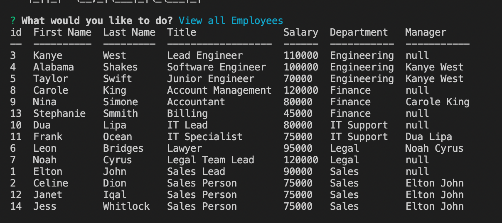
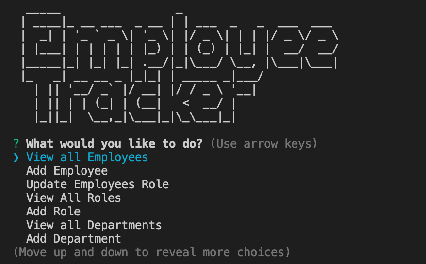

# Employee-Tracker

## Description
I created a command-line application for managing a company's employee database.This program uses MYSQL, Node.js and the Inquirer package. The user is able to add and view departments, roles and employees as well as update and employee's role within the company. 
## Table of Contents
- [Installation](#installation)
- [Usage](#usage)
- [Purpose](#purpose)
- [Experience](#experience)
- [Demo](#demo)
- [ScreenShot](#screenshot)
- [Collaboraters](#collaboraters)
- [License](#license)
- [Credits](#credits)
- [Tests](#tests)
- [Contributing](#contributing)
- [Questions](#questions)
## Installation
Run npm i to install the dependent packages, then node index.js in the terminal.
## Usage
Open index.js in the integrated terminal and run node index.js to start the application.
## Purpose
```
AS A business owner
I WANT to be able to view and manage the departments, roles, and employees in my company
SO THAT I can organize and plan my business
```
## Experience
I was able to query the database just fine to allow users to see options like employee Managers, role titles etc. Using the map method on the arrays being returned from the data was key to targeting exaclty what I needed. Console.logging everything returned from the database was also key in understanding how I needed to extract what I needed from the data. I had a difficult time updating or inserting the data into the data base until I learned Inquirer allows users to give a variable a name but give it a different value. For example, the user is able to see a list of department names but when the user selects a department, the value returned is the department id. This made it much easier to Update or Insert new values to the database. 
## Demo Video
Full video link to demo [here](https://drive.google.com/file/d/1lsDQfH1z14tTmk58cnVdslAOiplH_YND/view?usp=sharing). </br>

## Screen Shots
 </br>

## Collaboraters
N/A
## License
N/A
## Credits
The npm packages Inquirer, Console.table, and MYSQL2.
## Tests
  N/A
## Contributing 
  It is an open source project, please contact me to be added as a contributor.
## Questions
  If you have any questions or would like to discuss this application further, please reach out to me via email at [j.iqal35@gmail.com](mailto:j.iqal35@gmail.com) or visit my github profile at [janetiqal](http://www.github.com/janetiqal).
## Created By Janet Iqal
